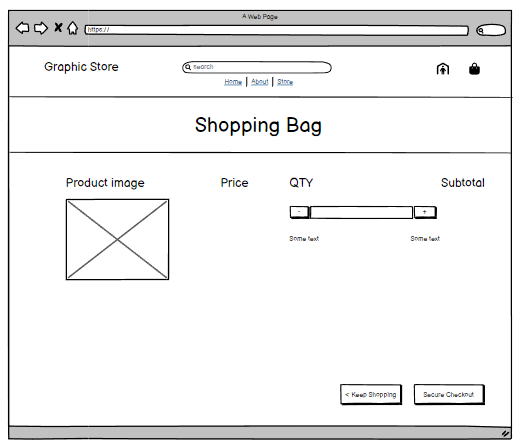
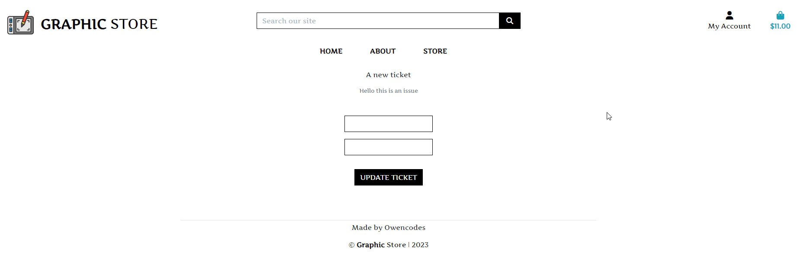

<h1 align="center">Graphic Store</h1>

Graphic Store is a site where users can see art work and people can view the differnt type of art the artist does and can order packages that have a discription of the art they are buying.

# Project Five

## User Experience

-   ### User stories

    -   #### First Time Visitor Goals

        1. As a First Time Visitor, you will be able to browse the home page and see examples of the art.
        2. As a First Time Visitor, you be able to search the store for the categories of art Abstract art - lofi and NFT art.
        3. As a First Time Visitor, You will be able to view a list of art available on the store
        4. As a First Time Visitor, You will be able to sign for the newsletter even if you dont have a profile account.

    -   #### Returning Visitor Goals

        1. As a Returning Visitor, you will be able to create an account by singing up.
        2. As a Returning Visitor, you will be able to have a profile page that saves your orders history and details.
        3. As a Returning Visitor, you will be able to submit a ticket if you have any issues buying something.
        4. As a Returning Visitor, you will be able to subscribe to a newsletter if wanted.
        5. As a Returning Visitor, you will be able to see comments on the graphic desingers art work.

    -   #### Frequent User Goals
        1. As a Frequent User, You will be to test buy a product by trying one of stripes testing cards.
        2. As a Frequent User, You will be able to come back and see if there is any new art work in the store.
        3. As a Frequent User, You will be able to see any changes made to the site.
    
    - ### Admin user stories
        1. As a superuser you will be able to see a list of users who registered on the site
        2. As a superuser you will be able to manage products with crud functionality on the frontend and admin panel
        3. As a superuser you you will be able to manage the comments on products by deleting them in the admin panel.

-   ## Target Audience
    - The target audience for the website is for anyone who is looking to buy some art that they would like to use as their desktop background or background in general for all social of their social accounts or anything they would like.

-   ## Technical design
    - ### Agile design
    - I used An Agile approach to creating this app has been applied. I used Githubs project kanban board to track issues I made and implement ideas based on their level of importance for allowing use of the app with no loss of functionality or user experience. Since only worked on this project solo I only used the one the main branch to implement the features on the site on the site.

    - By taking using AGILE methodology in this project i was able to deliver a site which had all required functionality. Due to the time limit on this project i was not able to incorporate all intial listed features but this is where an AGILE approach is great for app design. The project displays this by having User stories in the Done section and the ones which decided to be left for future put in the future implementation.

    - ### Crud Functionality
    - Graphic Store handles data with full CRUD Functionality for users on the frontend:
    - Create - Users can create a profile account and create comments / tickets and sign up for a newsletter
    - Read - Users can read the discription of the art work details and read their oder history details.
    - Update - Users can update their location details and newsletter email and comments
    - Delete - Useres can delete thier comments and remove thier email for the newsletter if they so choose.

-   ### Colours
     - The three main colours used are white for the background and black for the text. 
    
-   #### Typography
     - The Typography I used for this project is called Artifika I picked this font because it seemed like a nice font to use for a graphic store.

-   #### Imagery
     - The Imagery comes from a variatey of places such as Freepik and Pixabay I thought would be best for the site.

### Features I aimed to achieve with this project:

 - I aimed to achive a nice easy to navigate site with minimal effort
 - I amed to bring people in who are intrested in art but dont have the time to do it
 - I aimed to make an easy to use graphic for a user to purchase art work they like.

# Structure

*   ### Database
    - The site uses a backend database built with the Django framework and the use of ElephantSQL Postgres and heroku for the deployed site.

*   ### Web pages
    - User experience was one of the main driving factors in this project. A simple, clear and easy to navigate app was the desired outcome. 

    - Home Page: The home page shows you the logo the main links and search bar with a shopping cart and a register and signup dropdown menu on the person icon for my account and there is also a carosel just below the navbar and some nice bootstrap card components 

    - About Page: The About page shows you same navbar as the home page and also the carosel just below the navbar and some nice boot strap card components to explain the the three topics of the site for the art work.

    - Store Page: The store page has the same thing again for the navbar and the carosel at the top the rest of the page is just a  

    - Register Page: The Register page consists of a sign up form for the user to create a user name and a password for their account
    
    - Login Page: The Login page consists of a similar form like the register page but this for after the user has created their account

    - Profile Page: The Profile Page consists of the details for the persons delivery and their order history which you can view on the right side there is also a ticket section at the bottom and update your email for the newsletter if you want to change your email for that.
  
* ### Github - User Project Kanban Board
    - During development I used the project kanban board in github for keeping track of the progress during development for the site.

    

* ### ERD - Entity Relation Diagram schema
    - (Database Schema Image) Before I started to code this project I created a Diagram Entity Relationship - Database Schema using dbdiagram. I created this to easier understand the database models that I was going to create for this project.

    

* ### The 3 Custom models are | Newsletter | Comments and tickets
    1. The Three custom models I used for this project were setting up newsletter functionality with crud
    2. I also added comments on the detailed page for each of Products with all crud functionality
    3. I also added A ticket support system on the users profile page which has all crud functionality

* ### Sitemap 
     I went to site map website to get visual help for the site map for my site https://www.mysitemapgenerator.com/ 
     Then I made the actual site map in balsamic wireframes
     
     

* ### Robots 
     I went to this site map to get a demo for the robots.txt https://en.ryte.com/

* # Wireframes
    

    
-Desktop Wireframes:

     Home Page 

     

     About Page

     

     Store Page

     

     Profile Page

     

     Shopping bag Page

     
     
     Register Page

     

     Login Page 

     
    

    

    
-Mobile Wireframes:

     Home Page 

     

     About Page

     

     Store Page

     

    

### Frameworks, Tech Used

1. [Bootstrap 4.4.1:](https://getbootstrap.com/docs/4.4/getting-started/introduction/)
    - Bootstrap was used to assist with the responsiveness and styling of the website.
3. [Google Fonts:](https://fonts.google.com/)
    - Google fonts were used to import the 'Titillium Web' font into the style.css file which is used on all pages throughout the project.
4. [Font Awesome:](https://fontawesome.com/)
    - Font Awesome was used on all pages throughout the website to add icons for aesthetic and UX purposes.
5. [Git](https://git-scm.com/)
    - Git was used for version control by utilizing the Gitpod terminal to commit to Git and Push to GitHub.
6. [GitHub:](https://github.com/)
    - GitHub is used to store the projects code after being pushed from Git.
7. [Unsplash:](https://unsplash.com/)
    - Unsplash was used for some of the pictures on the blog site by typing in tech in to the search bar.
8. [Freepik:](https://www.freepik.com/)
    - pixabay was used for some of the pictures for testing posting a blog on the site
9. [pixabay:](https://pixabay.com/)
    - pixabay was used for some of the pictures for testing posting a blog on the site
10. [Balsamiq:](https://balsamiq.com/)
    - Balsamiq was used to create the [wireframes](https://github.com/) during the design process.
11. [Cloudinary:](https://cloudinary.com/)
    - Cloudinary was used to store the images that go on the website
12. [Draw.io](https://app.diagrams.net/)
    - Draw.io was used to create the ERD diagram for the models for the backend 

## Features 

- I aimed to achive a nice easy to navigate site with minimal effort. 
- I aimed the site to be driven more towards developers who wish to blog and talk about their projects
- I aimed to bring in more people and people who are new to tech and want to learn more.

In this section, I will go over each of the sections on the website such as the Navigation Bar, Main Page, Blog page, Footer section, admin 

### Existing Features
  # Features
  - Responsive on all device sizes
  - Interactive elements 
  - Store page
  - Shopping bag
  - Profile page
  - Newsletter
  - Support ticket

    
-Existing Features:

   
  __Navigation bar and carosel__

  

  __The Main Page Content__

  

  __About Page__

  

  __Store Page__

  
 

  __Detailed Product Page__

  

  __Users Profile Page__ 

  

  __The Checkout Page__

  

  __The Register Page__

  

  __The Login Page__

  

  __Newsletter__

  
  

  __Comments__

  

  __Tickets__

  
  
  
  __Shopping__

  

 __Drop-down__
 - Product management is only shown for super users
 
  

 - My Profile and logout is only shown for users who are logged in regular users dont have product management

  

__Sign-out-page__

  

__Success-message__

  

## Testing

The W3C Markup Validator and W3C CSS Validator Services were used to validate every page of the project to ensure there were no syntax errors in the project.

-   [W3C Markup Validator](https://jigsaw.w3.org/css-validator/#validate_by_input) - [Results](https://github.com/)
-   [W3C CSS Validator](https://jigsaw.w3.org/css-validator/#validate_by_input) - [Results](https://github.com/)

### Testing User Stories from User Experience (UX) Section

-   #### First Time Visitor Goals

    1. As a First Time Visitor, I want to easily understand the main purpose of the site and learn more about the organisation.

        1. Upon entering the site, users are automatically greeted with a clean and easily readable navigation bar to go to the page of their choice. Underneath there is a carosel that displays 3 pictures that repersent the 3 categories you can buy from the store.
        2. The main points are the 3 categories of the store are Abstract Art / NFT Art and Lofi Art on the home page

    2. As a First Time Visitor, I want to be able to easily be able to navigate throughout the site to find content.

        1. The site has been designed to be fluid and never to entrap the user. At the top of each page there is a clean navigation bar, each link describes what the page they will end up at clearly.
        2. 
        3. 

    3. As a First Time Visitor, I want to look for testimonials to understand what their users think of them and see if they are trusted. I also want to locate their social media links to see their following on social media to determine how trusted and known they are.
        1. Once the new visitor has read the About Us and What We Do text, they will notice the Why We are Loved So Much section.
        2. The user can also scroll to the bottom of any page on the site to locate social media links in the footer.
        3. At the bottom of the Contact Us page, the user is told underneath the form, that alternatively they can contact the organisation on social media which highlights the links to them.

-   #### Returning Visitor Goals

    1. As a Returning Visitor, I want to find the new .

        1. These are clearly shown in the .
        2. They will be directed to a page with .

        1. The navigation bar clearly highlights the "Contact Us" Page.
        2. Here they can fill out the form on the page or are told that alternatively they can message the organisation on social media.
        3. The footer contains links to the organisations Facebook page as well as the organization's email.
        4. Whichever link they click, it will be open up in a new tab to ensure the user can easily get back to the website.

    3. As a Returning Visitor, I want to find the Facebook Group link so that I can join and interact with others in the community.
        1. The Facebook Page can be found at the footer of every page and will open a new tab for the user and more information can be found on the Facebook page.
        2. Alternatively, the user can scroll to the bottom of the Home page to find the Facebook Group redirect card and can easily join by clicking the "Join Now!" button which like any external link, will open in a new tab to ensure they can get back to the website easily.
        3. If the user is on the "Our Favourites" page they will also be greeted with a call to action button to invite the user to the Facebook group. The user is incentivized as they are told there is a weekly favourite product posted in the group.

-   #### Frequent User Goals

    1. As a Frequent User, I want to check to see if there are any newly added products or art work.

    2. The user would already be comfortable with the website layout and can easily click the logo image.

    3. As a Frequent User, I want to check to see if there are any new art categories.

    4. As a Frequent User, I want to sign up to the Newsletter so that I am emailed any major updates and/or changes to the website or organisation Due to the time constraint I was not able to implement the email functionality for this to work.
        1. At the bottom of every page their is a footer which content is consistent throughout all pages.
        2. To the right hand side of the footer the user can see "Subscribe to our Newsletter" and are prompted to Enter their email address.
        3. There is a "Submit" button to the right hand side of the input field which is located close to the field and can easily be distinguished.

### Further Testing

-   The Website was tested on Google Chrome And Firefox
-   A large amount of testing was done to ensure that all pages were linking correctly.
-   Friends and family members were asked to review the site and documentation to point out any bugs and/or user experience issues.

### Known Bugs

-   On some mobile devices the Hero Image pushes the size of of the carosel image is stretched up abit

    
-Testing Screen Shots:

   
  - __Test if sql dumps data on input to see if any user data is displayed on the page__

  

  - __Order confirmation for when a product is bought__

  

  

  - __ Checkout success page after purchasing a product __

  

  - __ Order history saved in user profile page __

  
 

### Code

-   The full-screen carosel images came from this [Freepik](https://www.freepik.com/)

-   [Bootstrap4](https://getbootstrap.com/docs/4.4/getting-started/introduction/): Bootstrap Library used throughout the project mainly to make site responsive using the Bootstrap Grid System.

-   []
-   []
-   []

### Content

- All the content was done by me owenbcoding such as text and writing

### Media

-   All Images were taken from the following websites 
-   [Freepik](https://www.freepik.com/)
-   [Pixabay](https://pixabay.com/)

### Acknowledgements
-   Credit to code institute for projects template 

-   Credit to Freepik and pixabay for media and images

-   My Mentor for continuous helpful feedback.

-   Tutor support at Code Institute for their support.

-   Credit to Mikaela https://github.com/mikakallberg for helping me with crud functionality for comments

# Deployment

### Forking the GitHub Repository

By forking the GitHub Repository we make a copy of the original repository on our GitHub account to view and/or make changes without affecting the original repository by using the following steps...

1. Log in to GitHub and locate the [GitHub Repository](https://github.com/owenbcoding/p5-graphicstore)
2. At the top of the Repository (not top of page) just above the "Settings" Button on the menu, locate the "Fork" Button.
3. You should now have a copy of the original repository in your GitHub account.

### ElepthantSQL 
I used ElephantSQL for the database by connecting it to the project and Heroku 

    
-ElephantSQL:

    

### Heroku And Github
I connected ElephantSQL to my project and then to herkou by setting up the config vars for the projects deployment

    
-Heroku:

    
